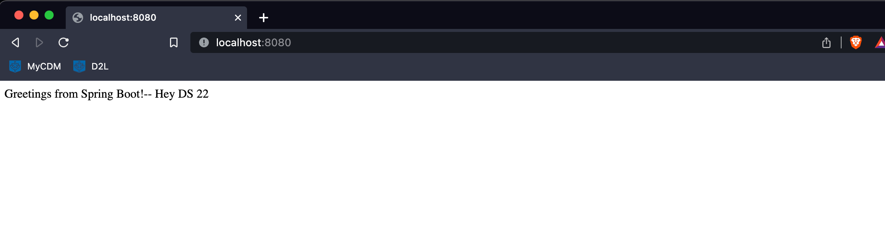

# SE452-Group10
## Purpose
Build an education management system similar to campus connect. The system has three types of users: students, teachers, and administrators. The system will have information on students and teachers such as personal information and class information
Students will be able to add/remove classes, check class schedules, and download
The teacher will post class information, types of classes, and when they happen
The administrator will have overarching access as a debugger.

 
* Milestone 1: Define the project and base structure and areas where each members will be working on

## Project Members

| Member | Area  | Saying |
| ----------- | ----------- | --- |
| Ayyub |  | <i></i>|
| Jared |   | <b></b>|
| Bhagya |   | <b></b>|
| Srinivasa |   | <b></b>|

 

## Conflict Resolution
First we vote, and then roll dice.

 

## Communication Mechanism
Will meet using Discord and Zoom.   Will meet once a week on tuesday .

## Meeting Notes
| #         | Date | Note    | Participants |
|-----------|------|---------|---------|
| 1     |   4.4.2023   | We decided our project scope and setup env. | All |
| 2     |   4.8.2023   | We create basic project, and initial key features for each of the members of the team. | All |

 

## Decision Made
| # | Area  | Decision | Alternative | Rationale|
| ----------- | ----------- | --- | --- |--- |
| 1 | IDE | Use VS Code |IntelliJ | Language independent editor so that it can be used in non java course|
| 2 | Dependency Management  | Gradle |
| 3 | Code  | Lombok | Code template code | We have done too many template code and so don't need to learn that|
| 4 | Configuration Management  | Yaml | Properties | Easier to view groups of configuration and it is different than what we learned in other classes with property files and so using this opporutnity to learn something different|

## Appendix 

Working code sample:

Application Started:
